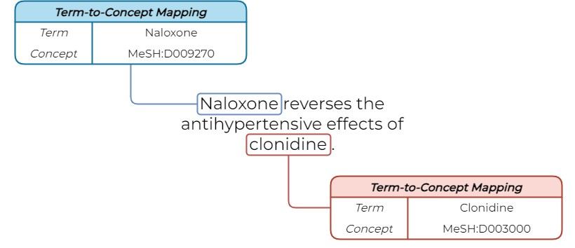

**N**amed **E**ntity **R**ecognition and **C**oncept **Link**ing
================================================================
Named Entiy Recognition (NER) is the task of identifying and categorizing named entities (or terms) found in unstructed text into pre-defined categories. We provide an example of this task in the following figure: 


It is an essential subtask of Natural Langauge Processing (NLP) known as information extraction (IE) that seeks to extract structured information from unstructured text. In addition to identifying named entities, NER is often leveraged as a basis for alternative but related tasks such as Named Entity Normalization (or Concept Linking [CL]) and Literature-based Discovery (LBD). The former of these two tasks (shown in the figure below) include normalizing named entities identified through NER processes onto candidate concepts found within pre-existing knowledge-bases (KBs) or ontologies (e.g., Unified Medical Language System [UMLS] Concept Unique Identifiers [CUIs] or Medical Subject Headings [MeSH] Terms).



This subtask is performed to marginalize term synonyms and address word sense disambiguation through its term-to-concept mapping strategy. The combination of these two subtasks provides an avenue to exploit latent mechanistic relationships found between disparate documents within literture (i.e., LBD). Our system Named Entity Recognition and Concept Linking (NERLink) combines both tasks into a single extensible framework.

NERLink is a Python-based experimental framework that performs NER and CL. It combines several known, and user-selectable, machine and deep learning (DL) architectures to perform these tasks. These architectures include: Multi-Layer Perceptron (MLP), Bidirectional Long-Short Term Memory Units (Bi-LSTM), Embeddings from Language Models (ELMo), and Bidirectional Encoder Representations from Transformers (BERT). It supports two generalization objectives: single-task and joint-task for NER and CL. Compared to single-task learning, joint-task learning uses multi-tasking to expedite model convergence by minimzing loss on two related tasks.

Typical CL systems require human annotation to identify named entities within unstructured text. Our future work includes leveraging our system to perform both tasks in an end-to-end fashion. This approach eliminates two disjoint systems and their respective constraints to perform NER and CL.

Installation
============
NERLink was developed and tested in Python version 3.6.x to 3.10.6. It relies on the Tensorflow API versions 1.15.2 to 2.10.0. Note: Tensorflow versions depend on the desired model (e.g., ELMo only supports Tensorflow 1.15.2 and BERT architectures only support Tensorflow 2.x). Tested operating systems to run our package include: Microsoft Windows 10 (64-bit) and Linux Mint (64-bit). Microsoft Windows is not pre-packaged with Python. We recommend installing the appropriate version from [python.org](https://www.python.org/).

*NOTE: Further mentions to Python refer to the Python3 installation environment.*

Prior to instaling NNLBD, we recommend creating virtual environment.

- Depending on how Python is installed in your system, one of the following commands will be appropriate:

    ```cmd
    Linux:
            python -m venv <name_of_virtualenv>
            python3 -m venv <name_of_virtualenv>
    Windows:
            python -m venv <name_of_virtualenv>
    ```
- To verify which version of Python is installed, you can check via:

    ```cmd
    python --version
    python3 --version
    ```

Next, we activate your virtual environment and update your `pip`, `setuptools`, and `wheel` packages.

```cmd
Linux:
       source <name_of_virtualenv>/bin/activate
       pip install -U pip setuptools wheel

Windows:
       "./<name_of_virtualenv>/Scripts/activate.bat"
       pip install -U pip setuptools wheel
```

*NOTE: Powershell users will need to use the `activate.ps1` script with suitable permissions or call `cmd` within powershell to execute the  `activate.bat` script.*


Python Requirements
===================

After the setup of your virtual environment is complete, install the necessary NNLBD package requirements.

- Python 3.10.x and TensorFlow 2.9.0 - *(Recommended)*
    ```cmd
    pip install -r requirements_mini_py3.10_tf2.9.0.txt
    ```
- Python 3.6.x and TensorFlow 2.4.0
    ```cmd
    pip install -r requirements_mini_py3.6_tf2.4.0.txt
    ```
- Python 3.6.x and TensorFlow 1.15.2
    ```cmd
    pip install -r requirements_mini_py3.6_tf1.15.2.txt
    ```

To manually install the required packages, execute the following commands:

- Python v3.10.2 and TensorFlow v2.9.0 - *(Recommended)*
    ```cmd
    pip install -U bioc==1.3.7 h5py==3.7.0 Keras==2.9.0 matplotlib==3.5.2 numpy==1.22.4 sacremoses==0.0.53 scipy==1.9.0 torch==1.11.0 tensorflow==2.9.0 tensorflow-addons==0.17.1 tensorflow-hub==0.12.0 transformers==4.26.1
    ```

- Python v3.6 and TensorFlow v2.4.0
    ```cmd
    pip install -U bioc==1.3.6 h5py==2.10.0 Keras==2.4.3 matplotlib==3.3.4 numpy==1.19.5 scipy==1.5.4 sparse==0.12.0 torch==1.7.1 tensorflow==2.4.0 tensorflow-addons==0.13.0 tensorflow-hub==0.12.0 tokenizers==0.10.3 transformers==4.8.2
    ```

- Python v3.6 and TensorFlow v1.15.2
    ```cmd
    pip install -U bioc==1.3.6 h5py==2.10.0 Keras==2.3.1 matplotlib==3.3.3 numpy==1.19.5 scipy==1.5.4 sparse==0.12.0 tensorflow==1.15.2 tensorflow-gpu==1.15.2 tensorflow-hub==0.12.0
    ```

    *NOTE: Transformer-based models are not supported for this environment*

Getting Started
===============
NERLink is an inheritance-based object-oriented framework. We provide an interface class to query the system. We provide several examples of running NER and CL architectures within the ```./experiments``` directory.

At the top of each script, there are several configurable variables. Configure each to your specifications and execute the script. Data preprocessing, data encoding, model training, inference, and basic post-processing is performed. For CL, all predictions will be exported in BioC format into the file specified by the ```write_file_path``` variable. To perform evaluation against the model's predictions in BioC format, the BioCreative VII - Track II (BC7T2) evaluation script is required. This script performs entity-level strict and lenient/approximate evaluations for NER and CL. It can be found [here](https://biocreative.bioinformatics.udel.edu/tasks/biocreative-vii/track-2/). For approximate CL evaluations, it requires the included ```parents.json``` file to be extracted in the root directory and specified by the ```--parents_filename``` argument of the BC7T2 evaluation script.

*NOTE: Our system only supports data files in BioC format. However, you can inherit the desired DataLoader class and override the Read_Data() function to extend functionality.*

Replicating Our Experiments
===========================
To replicate our CL experiments, we provide the following scripts:

```
./experiments/biocreative_cl_bert.py
./experiments/biocreative_cl_bert_alt.py
```

As stated in the second paragraph of the ```Getting Started``` section, configure the variables within the script of your choice to your desired settings. During execution, data preprocessing, data encoding, model training, inference, and basic post-processing is performed. To perform evaluation, the BioCreative CII - Track II (BC7T2) evaluation script is required. We provide further details [here](#getting-started).

Reference
=========
```bibtex
@inproceedings{10.1145/3487553.3524701,
    author = {Cuffy, Clint and French, Evan and Fehrmann, Sophia and McInnes, Bridget T.},
    title = {Exploring Representations for Singular and Multi-Concept Relations for Biomedical Named Entity Normalization},
    year = {2022},
    isbn = {9781450391306},
    publisher = {Association for Computing Machinery},
    address = {New York, NY, USA},
    url = {https://doi.org/10.1145/3487553.3524701},
    doi = {10.1145/3487553.3524701},
    abstract = {Since the rise of the COVID-19 pandemic, peer-reviewed biomedical repositories have experienced a surge in chemical and disease related queries. These queries have a wide variety of naming conventions and nomenclatures from trademark and generic, to chemical composition mentions. Normalizing or disambiguating these mentions within texts provides researchers and data-curators with more relevant articles returned by their search query. Named entity normalization aims to automate this disambiguation process by linking entity mentions onto their appropriate candidate concepts within a biomedical knowledge base or ontology. We explore several term embedding aggregation techniques in addition to how the term’s context affects evaluation performance. We also evaluate our embedding approaches for normalizing term instances containing one or many relations within unstructured texts.},
    booktitle = {Companion Proceedings of the Web Conference 2022},
    pages = {823–832},
    numpages = {10},
    keywords = {word embeddings, transformer, neural networks, named entity normalization, named entity linking, named entity disambiguation, entity normalization, entity linking, datasets, concept unique identifier, concept normalization, concept mapping, concept linking, MeSH identifier},
    location = {Virtual Event, Lyon, France},
    series = {WWW '22}
}
```


License
=======
This package is licensed under the GNU General Public License.


Authors
=======
Current contributors: Clint Cuffy